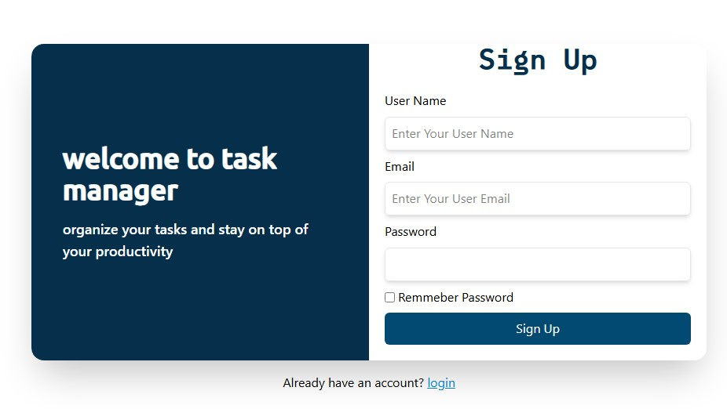
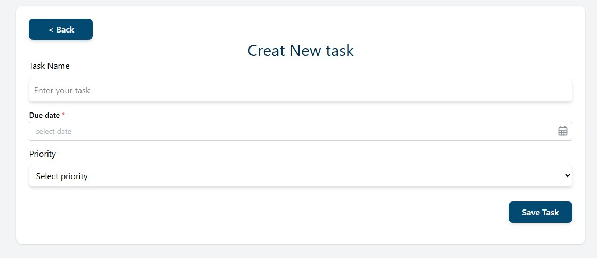

# 🗂️ Tasks Manager  
*A training project built during my React learning journey.*

A simple task management app built to practice modern React workflows such as routing, authentication, form handling, validation, and animations.  
This is a **learning-focused** project and not intended for production use.

---

## 🚀 Features
- Task creation & deletion  
- Mark tasks as completed  
- Filter tasks (All / Done / Not Done)  
- Priority selection  
- Due date selection (Date Picker)  
- User authentication (Signup/Login)  
- Token-based protected routes  
- Smooth UI animations (Framer Motion)  
- LocalStorage data persistence  

---

## 🛠 Tech Stack
**Frontend:** React, Vite, Tailwind CSS, React Router DOM v7, React Hook Form, Zod, Framer Motion, Mantine Date Picker, Axios  
**Backend (Mock):** JSON Server + JSON Server Auth  

---

## 🔐 Authentication
The app uses **JSON Server Auth**.  
Users must sign up, then a token will be generated and stored in `localStorage` for authenticated routes.

---

## ▶️ Run Locally
```bash
git clone https://github.com/mahdinap/Tasks-manager.git
cd Tasks-manager
npm install
npm run dev
```

Start JSON Server Auth:
```bash
npx json-server-auth db.json --port 3001
```

---

## 📸 Screenshots



---

## 📘 Notes
This is a training project built to improve React skills.  
Feedback and suggestions are always welcome!
